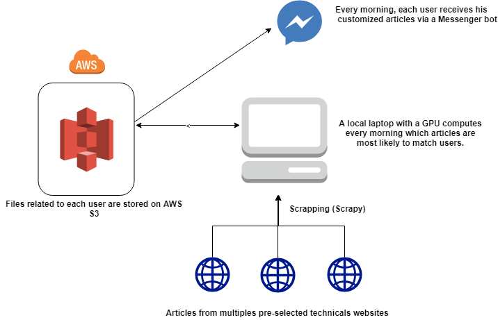

# DeepNews.ai

The objective of this project is to develop a messenger bot, which provides a technological watch on a specific theme (artificial intelligence in our case).

The project operates in several stages:

1. Load and clean the previously crawled data 
2. We get the last users and create a session for them if they are new
3. We load the data of each user and we reentrain the DNN
4. We predict which articles are the most suitable for each user
5. We update the data on S3

.

# Build your own recommendation system with Facebook Messenger

The purpose of the tutorial is to give you a guideline to develop your own recommendation system. We're going to build a system which performs technical monitoring. In our case we will focus on technical media. 

This article is divided in two parts : how to collect data and build a recommendation system and a second part, how to build a messenger bot which send daily messages and collect data to improve the recommendation. 


## First part : The recommendation system


1. Collect data
2. Clean Data
3. Predict articles 


### 1. Collect data

To manage all this section, we used python. First, build your environnement, you can use Anaconda (https://www.youtube.com/watch?v=pVME6JvdD5g&t=67s) or VirtualEnv. In our case, we used VirtualEnv with PyCharm for the IDE. 

The methode we use to collect the data is the scraping, using the library Scrapy. This is the first lib you need to install. 


**Collect data with Scrapy :** 

1. Create a project : scrapy startproject NameOfTheProject
2. cd /pathToYourProject
3. scrapy genspider NameOfTheCrawler theLinkOfASiteYouWantToScrap.anything

A file "NameOfTheCrawler" should have been created. Open this file and look at the code.

```python
# -*- coding: utf-8 -*-
import scrapy

class NameofthecrawlerSpider(scrapy.Spider):
    name = 'NameOfTheCrawler'
    allowed_domains = ['https://theLinkOfASiteYouWantToScrap.anything']
    start_urls = ['https://theLinkOfASiteYouWantToScrap.anything/']

    def parse(self, response):
        pass
```

Now we're going to fetch the webpage you want to scrap and select the appropriate data : title of the articles, link of the articles and we will add a date for later analysis.

1. Open a scrapy shell with command : scrapy shell
2. Fetch the website (we will scrap medium for the example) : fetch('https://medium.com/topic/artificial-intelligence')
3. If it output 200 it means that is works, then you need to search for the data you want

You can select data by using many informations : id, tag, h1, h2 etc... using response.xpath('YourXpath'). Check the doc if you want more explanation :  https://docs.scrapy.org/en/xpath-tutorial/topics/xpath-tutorial.html

Here is an example of the command we use to scrap Medium :
``` Python
# -*- coding: utf-8 -*-
import scrapy
from datetime import datetime

class MediumaiSpider(scrapy.Spider):
    name = 'MediumAI'
    allowed_domains = ['https://medium.com/topic/artificial-intelligence']
    start_urls = ['https://medium.com/topic/artificial-intelligence/']

    def parse(self, response):
        titles = response.xpath('//*[@id="root"]/div/section/section[1]/div[3]/div[1]/section/div/section/div[1]/div[1]/div[1]/h3/a/text()').extract()
        link = response.xpath('//*[@id="root"]/div/section/section[1]/div[3]/div[1]/section/div/section/div[1]/div[1]/div[1]/h3/a/@href').extract()
        now = datetime.today().strftime('%Y-%m-%d')
        clean_approx = []

        for sentence in titles:
            clean_approx.append((sentence.replace(",", "")))

        yield {"Title": clean_approx, 'Link': link, 'Date': now}
```

While you have edit your python file with your corrects xpath, you will be able to crawl the data by typing "scrapy crawl NameOfTheCrawler -o NameOfTheCrawler.csv" in a command shell at the root of your project. 

Then, create a bat file where you activate your environnement and then you run every crawler.

```
@echo off
cmd /k "MyPythonEnvironnement\Scripts\activate & scrapy crawl MediumAI -o MediumAI.csv &  scrapy crawl mediumtech -o MediumTech.csv & scrapy crawl approximatelycorrect -o approximatelycorrect.csv & scrapy crawl kdnuggets -o kdnuggets.csv"
```
It should store all your csv files in the same folder. Now we have to clean all this data to make predictions. 

### 2. Clean data


Since all the csv are stored in the same folder, we can load them and clean them in order to create a simple csv file with all the articles/links/dates. 

This task is done using the class DailyData. There are two functions to clean the csv files because differents websites return data with differents structures.

Then, in the main.py file, we load every file to add it in a huge csv file and then we save this file locally by calling it 'AI_articles_dataset.csv'.

### 3. Predict articles 

Once we have our articles of the day cleaned, we need to select 3 articles for each user depending on his preferences. 

In a firt time, we need to collect many data to build a recommendation system. Since we start with no data, there is a problem called the "Cold Start problem", which mean we have to give to users articles without knowing their preferences.

We will first use a basic neural network with transfer learning (ELMO) for the embbeding layer to make a classification between articles. Each user has his own file with his history of what he has read. We initialize it with a default file and then each day we add the previous day's data depending on whether or not he has read his articles.

The file **TrainModel.py** works in several steps :

1. Add the label from the previous day
2. Preprocessing on the daily data
3. Retraining of the model with new data
4. Predict 3 best articles and upload it on AWS S3

As soon as we have the 3 predicted articles uploaded on S3, the messenger bot is able to send the customized articles for each user. 
